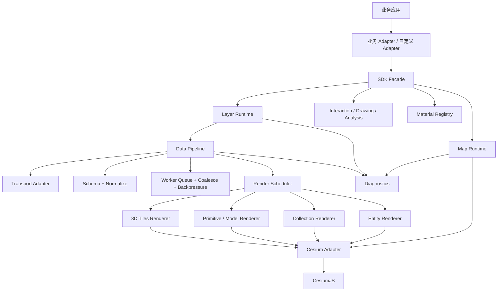

# gis-sdk 2.0 产品需求文档（PRD）

> 文档状态：Draft v1.0
> 编写日期：2026-08-17
> 项目名称：gis-sdk；首个 npm 包名：`@yanbobo/gis-sdk`（下文简称 SDK）
> 目标读者：产品负责人、GIS 架构师、前端负责人、仿真研发、测试、运维与文档维护者

## 1. 一页结论

现有业务 GIS 不应继续作为业务工程中的大单例类原地扩写，也不应照搬特定仿真页面实现。正确方向是：

1. 将 GIS 从业务项目中拆成一个框架无关、TypeScript 类型完整、可独立发布的 Cesium SDK。
2. 保留成熟业务项目通过封装方法降低团队研发成本的优点，但把大量平铺方法收敛为少量深模块：地图、图层、交互、绘制、分析、材质和诊断。
3. 默认提供开箱即用的完整包，业务方 5 分钟内创建地图；同时提供插件和 Cesium 高级出口，避免封装限制底层能力。
4. 把数据管线设计为 SDK 内建能力。Web Worker 只是其中的计算环节，完整管线还包括接入、校验、标准化、排序、去重、合并、背压、调度、渲染策略和指标。
5. 根据数据规模与交互需求自动选择 Entity、Collection、Primitive、Model 或 3D Tiles；默认不让业务方承担底层选型，但允许高级用户显式覆盖。
6. 新业务只依赖通用 GIS 数据契约。业务项目通过 Adapter 把各自业务对象转换为通用要素，SDK 核心不认识任何项目专有类型。
7. 文档产品必须和 SDK 同期交付，至少包含指南、类型化接口参考、在线示例、可运行代码、迁移手册、版本兼容表和性能选型指南，不能只依靠源码注释。

最终推荐形态：

```text
业务项目（已有项目 / 其他 GIS）
              │
       业务 Adapter（薄）
              │
   gis-sdk 稳定公开接口（小）
              │
  数据管线 + 图层运行时 + 渲染调度（深）
              │
       Cesium Adapter（唯一引擎接入点）
              │
          CesiumJS 公共接口
```

## 2. 背景与现状

### 2.1 已有业务 GIS 可保留的价值

已有业务 GIS 已经验证了 SDK 化调用对业务团队有价值：业务页面通过稳定的方法调用使用 GIS，不需要每个研发都理解 Cesium 的全部细节。

应保留的能力包括：

- 地图初始化和相机控制；
- 基础图层、地形、行政区、河流、风场等专题图层；
- 点、线、面、图标和模型；
- 绘制、编辑、选择、弹窗；
- 卫星/平台动态对象及关系线；
- 测距、通视等空间分析；
- 自定义材质和渲染效果；
- 对业务方提供稳定、低学习成本的方法调用。

### 2.2 当前实现的主要问题

现有实现普遍存在版本来源和运行耦合问题：

- 依赖声明与实际运行时资源可能不一致；
- 静态资源、全局脚本和构建产物混合管理，升级边界不清；
- 业务实现直接依赖全局 `Cesium`、配置对象、`window` 和 DOM；
- 地图入口、图层管理与辅助逻辑使用静态单例，无法自然支持多地图、隔离测试和按实例销毁。

其他核心问题：

| 问题 | 当前表现 | 影响 |
| --- | --- | --- |
| 接口过宽 | 单一全局入口暴露大量 `showX/closeX/setXCallback` 一类方法 | 学习成本持续增长，命名和行为难以统一 |
| 类型缺失 | JavaScript 对象、注释字段和运行时隐式约定 | 错误到运行时才暴露，IDE 无法可靠提示 |
| 生命周期不确定 | 全局单例、轮询等待回调、监听器散落 | 多项目、微前端、多 Viewer 和销毁重建风险高 |
| 私有接口依赖 | `_materialCache`、`_root`、`readyPromise` 等旧式或私有用法 | Cesium 升级容易破坏 |
| 渲染策略混用 | Entity、Primitive、Model 由各文件自行决定 | 缺少统一阈值、降级和性能预算 |
| 数据管线缺失 | 业务数据直接进入渲染层 | 大量实时数据下无法统一排序、去重、背压和合并 |
| 业务耦合 | 领域语义进入底层 SDK | 其他项目复用时被迫理解特定业务模型 |
| 文档不可交付 | 主要依赖源码 JSDoc 和旧 demo | 新项目无法按版本、按示例自助接入 |

### 2.3 可借鉴但不能直接复用的部分

已有仿真项目值得吸收的设计包括：

- TypeScript 领域类型；
- Worker 内 16ms 批次、按实体排队、排序和合并；
- 请求渲染模式、近中远 LOD 和视口外降级；
- `PointPrimitiveCollection`、`BillboardCollection`、底层 `Model` 等性能策略；
- 队列、合并数、LOD 数量等运行指标。

不能直接作为 SDK 的部分：

- 地图能力集中在大型 Vue 仿真页面；
- 接口以仿真 props、events 和 `defineExpose` 为主；
- 类型和流程依赖仿真运行时；
- 对普通 GIS 项目而言接口不通用。

因此本项目的方向是：保留成熟封装的通用调用体验，吸收类型化实时数据管线，而不是复制任一现有实现。

## 3. 产品定位

### 3.1 产品愿景

提供一套“安装即可创建地图、简单需求无需懂 Cesium、复杂需求仍可深入底层”的企业级三维 GIS SDK，使不同业务项目共用同一套地图能力、数据契约、性能策略和文档。

### 3.2 目标用户

| 用户 | 主要诉求 |
| --- | --- |
| 普通业务前端 | 用少量代码完成地图、图层、点线面、弹窗和事件 |
| GIS 研发 | 扩展图层、材质、分析工具和底层渲染策略 |
| 仿真研发 | 接入高频实体状态、轨迹、传感器范围和时间轴 |
| 架构/平台团队 | 跨 Vue/React/原生项目复用、统一版本和质量门禁 |
| 测试/运维 | 可观测、可压测、可定位资源泄漏和性能回归 |

### 3.3 核心使用场景

1. 新项目通过 npm 安装，在 5 分钟内显示底图、地形和一个业务图层。
2. 既有项目逐步从旧接口迁移，新旧接口可在过渡期共存。
3. 仿真业务将消息转换成通用动态要素，由 SDK 负责合并、LOD 和渲染。
4. 普通项目加载 GeoJSON、CZML、影像、地形、模型和 3D Tiles。
5. GIS 研发注册自定义材质或新图层，而不修改 SDK 核心代码。
6. 大数据场景根据规模自动选择渲染后端，并能看到为什么选择、是否降级和当前性能。
7. 内网/离线环境不依赖 Cesium ion 也能完整运行。

## 4. 目标与非目标

### 4.1 一期必须达到的目标

- 框架无关：核心包不得依赖 Vue、React、Pinia、Vuex 或具体业务 store。
- 实例化：同页至少支持 2 个独立地图实例，创建、销毁和配置互不影响。
- 类型化：公开接口、事件、配置、错误和数据模型 100% 有 TypeScript 声明；JavaScript 项目仍可使用。
- 开箱即用：提供完整预设包、默认样式、资产处理插件和最小初始化配置。
- 可扩展：图层、数据源、材质、分析工具和业务 Adapter 均有稳定扩展点。
- 可升级：业务代码不直接依赖 Cesium 私有成员，Cesium 版本只在引擎 Adapter 中处理。
- 大数据：内建 Worker 数据管线、批处理、背压、LOD 和渲染策略选择。
- 可诊断：能查询图层规模、渲染策略、队列水位、丢弃/合并数、加载阶段和帧窗口。
- 可迁移：提供旧接口兼容层和逐项迁移文档。
- 有文档：文档站、接口参考、示例和版本文档与 SDK 同版本发布。

### 4.2 明确不做

- 不把任何项目的完整业务模型放进 SDK 核心。
- 不承诺“任意数量数据自动高帧率”；超大数据必须采用分块、瓦片或服务端预处理。
- 不重新实现 Cesium 的地球、坐标、瓦片和 WebGL 引擎。
- 不把所有 Cesium 类重新包一层；浅透传封装不产生价值。
- 不在一期建设完整低代码 GIS 编辑器。
- 不保证业务方绕过 SDK、直接使用任意 Cesium 私有接口后仍享受版本兼容。
- 不把 Worker 当成万能渲染线程；Viewer、DOM 和 WebGL 操作仍在主线程。

## 5. 产品原则

### 5.1 小接口、深实现

公开接口只暴露业务真正需要理解的概念。数据标准化、渲染器选择、资源复用、批次更新、错误恢复和清理由模块内部完成。

删除一个 SDK 模块后，如果复杂度会重新散落到所有项目，说明该模块有价值；如果删除后业务只是少写了一行 Cesium 调用，则该封装过浅，不应进入公共接口。

### 5.2 默认简单，高级能力渐进开放

- 默认：完整包 + 自动渲染策略 + 合理默认值；
- 进阶：显示指定渲染策略、数据策略和材质；
- 专家：插件接口和 `raw.cesium` 高级出口。

### 5.3 通用核心，业务适配

SDK 核心只理解 `Feature`、`Layer`、`Position`、`DynamicObject`、`Coverage` 等通用对象。业务对象在项目 Adapter 中转换。

### 5.4 公开接口优先

业务模块禁止访问以下形式：

- Cesium 以下划线开头的成员；
- SDK 内部对象和集合；
- 未写入兼容矩阵的实验接口。

确有必要使用 Cesium 内部能力时，只能集中在 `cesium-internals` 隔离模块，并必须有锁定版本、契约测试和升级告警。该模块不对业务公开。

## 6. 总体架构



### 6.1 模块职责

| 模块 | 公开职责 | 隐藏的实现复杂度 |
| --- | --- | --- |
| Map Runtime | 创建、就绪、销毁、场景配置 | Cesium Viewer、资产路径、渲染循环、生命周期 |
| Layer Runtime | 添加、查询、排序、显隐、移除图层 | 数据源、Cesium 集合、资源所有权和级联清理 |
| Data Pipeline | 快照、增量、流式数据接入 | Worker、校验、去重、排序、合并、背压、调度 |
| Render Scheduler | 自动/指定渲染策略 | Entity/Primitive/Model/Tiles 的差异和迁移 |
| Interaction | 点击、悬停、框选、选择集 | pick、事件优先级、冒泡、节流和取消订阅 |
| Drawing | 绘制、编辑、撤销重做 | 临时要素、控制点、状态机、鼠标/键盘处理 |
| Analysis | 统一执行分析工具 | 地形采样、异步取消、临时结果图层 |
| Material Registry | 注册、创建和释放材质 | Shader、uniform、纹理缓存、Cesium 适配 |
| Diagnostics | 快照和事件 | 帧窗口、队列、资源、图层和错误指标 |

## 7. 包与仓库设计

建议建立独立 monorepo，不直接在业务应用目录内开发新内核。

```text
gis-sdk/
  packages/
    core/              # 通用类型、生命周期、图层与数据管线接口
    cesium/            # Cesium Adapter 与具体渲染实现
    sdk/               # 开箱即用完整预设包
    vue/               # Vue 3 Adapter，不进入 core
    legacy/            # 旧接口兼容层
    devtools/          # 可选诊断面板
  plugins/
    materials-standard/
    analysis-standard/
  examples/
    vanilla/
    vue/
    react-or-other/
    simulation-stream/
    large-data/
  docs/
  benchmarks/
  tests/
```

### 7.1 发布包建议

| 包 | 用途 | 依赖策略 |
| --- | --- | --- |
| `@yanbobo/gis-sdk` | 普通项目首选，开箱即用 | 固定安装经过验证的 Cesium 与标准插件 |
| `@yanbobo/gis-core` | 高级集成、非 Cesium 契约和测试 | 不依赖框架、不暴露 Cesium 类型 |
| `@yanbobo/gis-cesium` | 引擎 Adapter | 以精确兼容范围约束 `cesium`，防止重复实例 |
| `@yanbobo/gis-vue` | Vue 3 组件和 composable | 仅依赖 SDK 公开接口 |
| `@yanbobo/gis-legacy` | 旧接口方法适配 | 只用于迁移，明确废弃周期 |
| `@yanbobo/gis-devtools` | 开发环境诊断 | 生产可完全不打包 |

一期不建议把每个小能力都拆成 npm 包。包过多会增加版本、依赖和文档成本。只有确实存在按需安装、独立演进或两个实现的模块才拆包。

## 8. 核心公开接口

对外可以使用 class 和对象句柄，但不能再使用全局单例大类。推荐由异步工厂创建 Map 实例，实例内部再提供类型化 Controller/Handle；这样既保留 `map.layers.add()` 这类直观方法调用，也支持多地图、依赖注入、测试和确定性销毁。业务方不需要继承 SDK 类。

### 8.1 五分钟快速开始

```ts
import { createMap } from '@yanbobo/gis-sdk'
import '@yanbobo/gis-sdk/styles.css'

const map = await createMap({
  container: 'map',
  scene: { mode: '3d' },
  basemap: {
    type: 'xyz',
    url: '/tiles/{z}/{x}/{y}.png'
  }
})

const layer = await map.layers.add({
  id: 'stations',
  type: 'graphics',
  render: { strategy: 'auto' }
})

await layer.setData([
  {
    id: 'station-001',
    geometry: { type: 'Point', coordinates: [116.39, 39.9, 0] },
    style: { icon: '/assets/station.png', label: '站点 001' },
    properties: { status: 'online' }
  }
])

const off = map.events.on('feature:click', event => {
  console.log(event.feature.id, event.position)
})

// 页面卸载时
off()
await map.destroy()
```

验收要求：快速开始不得要求业务方配置 Cesium 静态脚本、设置全局变量、手工创建 Worker 或访问 Viewer 私有成员。

### 8.2 顶层接口

```ts
interface GisMap {
  readonly id: string
  readonly ready: Promise<void>
  readonly layers: LayerManager
  readonly camera: CameraController
  readonly events: EventHub<MapEventMap>
  readonly drawing: DrawingController
  readonly analysis: AnalysisController
  readonly materials: MaterialRegistry
  readonly diagnostics: Diagnostics
  readonly raw: Readonly<EngineEscapeHatch>

  resize(): void
  snapshot(options?: SnapshotOptions): Promise<Blob>
  destroy(): Promise<void>
}
```

顶层不再继续增加 `showX/closeX`。新专题能力通过图层、分析工具或插件进入。

### 8.3 图层接口

```ts
interface LayerManager {
  add<TSpec extends LayerSpec>(spec: TSpec, options?: OperationOptions): Promise<LayerHandleFor<TSpec>>
  get(id: string): LayerHandle | undefined
  list(): readonly LayerInfo[]
  remove(id: string): Promise<boolean>
  clear(): Promise<void>
}

interface LayerHandle {
  readonly id: string
  readonly type: LayerType
  readonly state: LayerState
  setVisible(visible: boolean): void
  dispose(): Promise<void>
}

interface FeatureLayerHandle<T extends GisFeature = GisFeature> extends LayerHandle {
  setData(features: readonly T[], options?: SetDataOptions): Promise<UpdateResult>
  apply(changes: readonly FeatureChange<T>[], options?: ApplyOptions): Promise<UpdateResult>
  connect(source: StreamSource<T>, options?: StreamOptions): Promise<StreamHandle>
  query(query: FeatureQuery): Promise<readonly T[]>
}

interface ImageryLayerHandle extends LayerHandle {
  setOpacity(opacity: number): void
  setZIndex(zIndex: number): void
}
```

通用句柄只包含所有图层都能稳定支持的操作。数据更新属于 Feature 图层，透明度和排序属于 Imagery 图层；具体 Adapter 可以继续提供 WMS 样式、过滤等类型专属能力，禁止用运行时“不支持”填充表面统一的接口。

统一成 `setData`、`apply` 和 `connect` 三种数据入口：

- `setData`：全量快照替换；
- `apply`：增删改补丁；
- `connect`：持续流式数据。

业务不再分别学习 `showSatellite/addSatelliteData/updateSatelliteData/deleteSatelliteData/exportSatelliteData`。

### 8.4 增量数据

```ts
type FeatureChange<T> =
  | { op: 'upsert'; feature: T; sequence?: number; timestamp?: number }
  | { op: 'patch'; id: string; patch: DeepPartial<T>; sequence?: number; timestamp?: number }
  | { op: 'remove'; id: string; sequence?: number; timestamp?: number }
  | { op: 'clear' }
```

每个更新结果必须可诊断：

```ts
interface UpdateResult {
  accepted: number
  rendered: number
  coalesced: number
  dropped: number
  rejected: readonly ValidationIssue[]
  durationMs: number
  renderStrategy: RenderStrategy
}
```

### 8.5 事件接口

所有订阅必须返回取消函数，禁止只提供 `setXCallBack`：

```ts
const off = map.events.on('feature:hover', handler, {
  layerId: 'satellites',
  throttleMs: 50
})

off()
```

一期事件至少包括：

- `map:ready`、`map:error`、`map:destroy`；
- `camera:move-start`、`camera:changed`、`camera:move-end`；
- `feature:click`、`feature:dblclick`、`feature:hover`、`feature:contextmenu`；
- `selection:changed`；
- `layer:added`、`layer:state-changed`、`layer:removed`；
- `stream:backpressure`、`stream:dropped`、`stream:error`；
- `performance:degraded`、`webgl:context-lost`、`webgl:context-restored`。

### 8.6 异步与错误约定

- 创建、加载、分析、全量更新、销毁均返回 Promise；
- 连续状态变化使用事件；
- 所有长任务支持 `AbortSignal`；
- 禁止 Promise、callback 和轮询三种模式混用；
- 错误统一为 `GisError`，包含 `code`、`module`、`operation`、`retryable`、`cause` 和脱敏上下文；
- 参数错误同步抛出，资源/网络/异步处理错误通过 Promise reject 或事件返回；
- SDK 内部诊断失败必须 fail-open，不得破坏地图业务。

### 8.7 Cesium 高级出口

```ts
const { viewer, Cesium } = map.raw.cesium
```

要求：

- 该出口用于 SDK 尚未覆盖的高级场景，不是普通业务默认路径；
- 使用 Cesium 公共接口仍受 SDK 支持；
- 访问 Cesium 私有成员视为业务自行承担升级成本；
- SDK 诊断需标记该项目使用了 escape hatch，便于升级审计；
- 插件优先接收受限的 `RenderContext`，而不是任意修改 Viewer。

## 9. 通用类型化数据契约

### 9.1 基础类型

```ts
type FeatureId = string
type LayerId = string
type TimestampMs = number

interface GeoPosition {
  longitude: number
  latitude: number
  height?: number
  reference?: 'ellipsoid' | 'terrain' | 'clamp-to-ground'
}

interface GisFeature<P = Record<string, unknown>> {
  id: FeatureId
  geometry: GisGeometry
  properties?: P
  style?: FeatureStyle
  availability?: TimeInterval
}
```

坐标规则必须写入接口约定：

- 经度范围、纬度范围和高度单位；
- 默认使用 WGS84，经纬度单位为度，高度单位为米；
- 其他坐标系必须通过 `CoordinateTransform` Adapter 显式转换；
- 禁止同一字段有时表示弧度、有时表示度；
- 时间统一采用 epoch 毫秒或 ISO 8601，进入内核后统一为 epoch 毫秒。

### 9.2 动态对象

```ts
interface DynamicObjectFeature<P = Record<string, unknown>> extends GisFeature<P> {
  geometry: { type: 'Point'; coordinates: [number, number, number?] }
  motion?: {
    timestamp: TimestampMs
    heading?: number
    pitch?: number
    roll?: number
    velocity?: [number, number, number]
    interpolation?: 'hold' | 'linear' | 'hermite'
  }
  representation?: {
    near?: 'model' | 'billboard'
    mid?: 'billboard' | 'point'
    far?: 'point' | 'hidden'
  }
}
```

项目专有的动态对象或其他业务对象均由项目 Adapter 转成此类型。SDK 不反向依赖业务类型。

### 9.3 覆盖区和关系

覆盖区、传感器、波束、链路和轨迹使用通用类型：

- `CoverageFeature`：圆、扇形、椭圆、圆锥、视锥或自定义体；
- `RelationFeature`：source/target、线样式、箭头和状态；
- `TrackFeature`：时间采样点、尾迹窗口和简化策略；
- `VolumeFeature`：盒、球、椭球、圆柱和自定义 Geometry。

## 10. 数据管线

### 10.1 数据管线不等于 Web Worker

完整链路如下：

```text
HTTP / WebSocket / SSE / 本地文件 / 业务 push
  -> 解码与协议识别
  -> Schema 校验
  -> 坐标、时间、单位和 ID 标准化
  -> 排序、去重、过期判断
  -> 分实体队列与消息合并
  -> 有界队列、背压和丢弃策略
  -> 空间索引、LOD 和可见性候选
  -> 主线程渲染调度
  -> Entity / Collection / Primitive / Model / 3D Tiles
  -> 性能与质量指标
```

Worker 负责适合离开主线程的 CPU 工作：解析、校验、转换、排序、去重、轨迹抽稀、聚合、空间索引和批次生成。Worker 不直接访问 Viewer、DOM 或 WebGL。

### 10.2 输入 Adapter

一期内建：

- 数组/对象快照；
- GeoJSON；
- CZML；
- JSON 字符串或二进制消息；
- WebSocket/SSE 流；
- 用户提供的 `AsyncIterable`；
- 旧接口数据 Adapter。

后续可选：MVT、FlatGeobuf、GeoParquet/Arrow、专用仿真二进制协议。

### 10.3 Worker 池

- 默认由 SDK 自动创建，不要求业务手工管理；
- Worker 数量根据硬件并发和任务类型设置上限，默认不超过 `min(4, hardwareConcurrency - 1)`；
- 支持 transferable objects，避免大数组重复拷贝；
- Worker 初始化失败时可降级主线程小批处理，并发出诊断事件；
- Worker URL 和 CSP 策略必须支持 Vite、Webpack/Rspack 和离线部署；
- 每个 Map 不必独占完整池，允许同一 SDK Runtime 共享但保持任务隔离。

### 10.4 排序、合并与过期策略

每个流必须声明：

```ts
interface StreamPolicy {
  keyBy: 'featureId' | ((message: unknown) => string)
  ordering: 'arrival' | 'sequence' | 'timestamp'
  coalesce: 'none' | 'latest' | 'trajectory-window' | CustomCoalescer
  maxQueueItems: number
  maxQueueBytes: number
  maxLatencyMs: number
  staleAfterMs?: number
  overflow: 'drop-oldest' | 'drop-newest' | 'keep-latest' | 'disconnect'
}
```

默认动态对象采用“按对象分队列 + 保留最新有效状态 + 必要轨迹窗口”。控制消息、删除消息和告警消息不得被普通状态更新错误覆盖。

### 10.5 批次和渲染调度

- 数据输入可高频，但渲染提交按帧预算进行；
- 默认批次窗口自适应在 16-50ms 范围，不承诺每条消息都产生一帧；
- 相同对象同一窗口内的中间状态可合并；
- 相机移动时优先保证交互帧率，可暂缓低优先级图层更新；
- 后台标签页降低刷新频率；
- 一次提交超过帧预算时自动切分到后续帧；
- 调度器必须能报告等待、处理、合并、丢弃和渲染数量。

### 10.6 背压

当输入速度大于消费速度时，禁止无限增长数组。必须：

1. 触发水位事件；
2. 按消息优先级合并或丢弃；
3. 对可控数据源请求降频或暂停；
4. 对不可控 WebSocket 保持有界缓存；
5. 记录丢弃原因和数量；
6. 队列恢复后发出恢复事件。

## 11. 渲染策略与大数据能力

### 11.1 自动渲染策略

| 数据形态 | 默认候选 | 适用原因 | 不适用情况 |
| --- | --- | --- | --- |
| 少量、高交互、属性动态 | Entity | 开发简单、属性系统和事件成熟 | 高频大量对象 |
| 大量同类点/图标 | Point/Billboard Collection | 批量管理、较低对象开销 | 每对象复杂模型 |
| 超高吞吐点线面（候选） | Buffer Point/Polyline/Polygon Collection | 新版 Cesium 提供的性能导向批量能力 | 当前属于实验能力，必须隔离并验证后启用 |
| 大量静态线面 | batched Primitive/GeometryInstance | 减少 draw call 和 JS 对象 | 高频单体编辑 |
| 独立 glTF 对象 | Model | 直接控制矩阵、姿态和动画 | 数万独立模型 |
| 大规模城市/倾斜/海量模型 | 3D Tiles | 分块、LOD、流式加载 | 少量临时编辑对象 |
| 动态轨迹 | 分段 Primitive/专用 Track Renderer | 批次更新和窗口裁剪 | 少量可编辑轨迹可用 Entity |

`Cesium.Model` 比 Entity 的模型图形层更接近渲染层，但不是绝对“最底层”。SDK 不以“越底层越好”为原则，而以数据规模、更新频率、交互和维护成本综合选择。

### 11.2 策略配置

```ts
interface RenderPolicy {
  strategy?: 'auto' | 'entity' | 'collection' | 'primitive' | 'model' | '3d-tiles'
  profile?: 'interactive' | 'balanced' | 'throughput'
  lod?: LodPolicy | false
  clustering?: ClusterPolicy | false
  requestRenderMode?: 'auto' | 'always' | 'on-demand'
  frameBudgetMs?: number
  allowFallback?: boolean
}
```

当指定策略不适合当前规模时：

- `allowFallback: true`：SDK 切换并发出原因；
- `allowFallback: false`：保持策略但发出性能告警；
- 开发模式 DevTools 展示“当前策略、选择原因、阈值和退化记录”。

### 11.3 LOD 规则

LOD 至少同时考虑：

- 相机到对象距离；
- 屏幕空间像素尺寸；
- 是否在视锥/视口内；
- 对象是否被选中或处于告警状态；
- 设备性能等级；
- 当前帧预算和队列积压。

典型动态平台：近距离模型 + 传感器，中距离图标，远距离点，视口外暂停重资源更新。选中对象可覆盖 LOD 保持可见。

`requestRenderMode` 主要降低静止场景的空闲 CPU，不是大数据批处理或降采样方案。SDK 的 Render Scheduler 统一记录 dirty reason 并调用 `requestRender()`；图层、材质和业务 Adapter 不得各自启动渲染循环。

### 11.4 大数据强制规则

- 禁止每帧遍历全部对象后再判断可见；应维护活动集合或空间索引；
- 禁止“一条消息立即一次 Cesium 更新”；必须批次提交；
- 禁止海量数据使用 DOM Overlay；Overlay 只用于少量当前交互对象；
- 禁止用一个 Entity 承载一个超大静态点集；
- 百万级静态数据必须瓦片化或服务端分块，不接受一次性创建百万 JS 对象作为正式方案；
- 重复模型优先复用资源、实例化或 3D Tiles；
- 轨迹按时间窗和屏幕误差抽稀，不无限保存和渲染历史点；
- 图层隐藏/移除必须停止数据源、Worker 任务、Timer、事件和 GPU 资源。

### 11.5 性能验收基线

以下是立项目标，必须用固定基准机和真实数据复验后冻结。建议基准环境：16GB 内存、公司中档办公机、1920×1080、Chrome 稳定版、无 DevTools、固定本地数据源。

| 场景 | 一期目标 |
| --- | --- |
| 空地图 | 首个可交互画面 p95 ≤ 2.5s（本地底图，缓存冷启动） |
| 10 万静态点 | 首次可见 p95 ≤ 3s，稳定相机操作 p95 ≥ 45 FPS |
| 1 万动态点，1Hz 输入 | 更新端到可见 p95 ≤ 150ms，稳定 p95 ≥ 40 FPS |
| 1,000 个可见独立模型 | LOD 开启后稳定 p95 ≥ 30 FPS，无逐帧全量重建 |
| 百万级静态要素 | 必须经瓦片/分块加载，首屏不一次性下载完整数据 |
| 相机飞行 | 交互期间输入无明显阻塞，INP p95 ≤ 200ms |
| 图层销毁 | 无残留 SDK Timer/监听/Worker；强制 GC 基准中堆和 GPU 指标回到初始值 20% 范围内 |
| 长稳测试 | 8 小时流式更新无无界队列、无持续内存单调增长 |

所有数据量指标必须同时记录对象类型、样式复杂度、可见数量、更新频率、网络和硬件，禁止只写“支持十万/百万数据”。

## 12. 图层与数据能力

### 12.1 一期图层矩阵

| 类别 | 一期 | 后续 |
| --- | --- | --- |
| 底图 | XYZ、TMS、WMTS、WMS、单图、无底图 | 企业地图目录、缓存策略 UI |
| 地形 | Cesium Terrain、本地地形、椭球 | 多地形切换和融合策略 |
| 矢量 | GeoJSON、点线面、标签、图标 | MVT、FlatGeobuf |
| 模型 | glTF/GLB、姿态、缩放、动画基础控制 | 实例化工具、模型编辑器 |
| 3D Tiles | 加载、样式、变换、显隐、拾取 | 元数据查询和高级裁剪 |
| 动态对象 | 状态增量、轨迹、LOD、选择 | 预测、插值策略插件 |
| 覆盖/关系 | 圆、扇形、椭球、链路和箭头线 | 复杂体和 GPU 专用实现 |
| DOM 展示 | Popup、Overlay、Tooltip | 复杂可视化面板由业务实现 |

### 12.2 图层状态机

```text
created -> loading -> ready -> hidden -> disposed
              │         │
              └-> error <-┘
```

- `loading` 可取消；
- `error` 可根据错误类型重试；
- `disposed` 为终态，重复销毁幂等；
- 状态改变必须可订阅；
- 图层拥有其创建的所有 Cesium、Worker、资源和事件句柄，并负责级联释放。

## 13. 材质与底层覆盖能力

### 13.1 材质注册接口

```ts
interface MaterialDefinition<TUniforms> {
  id: string
  displayName: string
  targets: readonly ('polyline' | 'polygon' | 'wall' | 'volume' | 'model')[]
  uniforms: UniformSchema<TUniforms>
  create(context: MaterialContext, uniforms: TUniforms): MaterialInstance
  validate?(uniforms: TUniforms): readonly ValidationIssue[]
}

map.materials.register(flowLineMaterial)
```

要求：

- uniform 类型、默认值、范围和资源类型可生成文档；
- 同一材质定义可被多个图层复用；
- 纹理有缓存、引用计数和销毁；
- Shader 编译错误映射为稳定错误码；
- 材质实例必须可更新参数，不能要求重建整个图层；
- 内建流光线、虚线、渐变面、扫描、扩散、告警闪烁等常用材质；
- 自定义材质不得要求业务调用 `Cesium.Material._materialCache`。

材质能力分级：SDK 内建材质为 stable，自定义材质注册协议首期为 beta，原生 GLSL/`CustomShader` 出口为 experimental。Cesium 官方目前仍将 `CustomShader` 标记为实验能力，因此不能把其当前签名直接变成 SDK 的长期稳定契约。

### 13.2 底层扩展层级

1. 样式配置：普通业务使用；
2. 材质插件：GIS 研发使用；
3. 自定义图层/Renderer 插件：高性能或新几何类型；
4. `raw.cesium`：未覆盖高级需求的逃生口；
5. `cesium-internals`：只允许 SDK 维护者使用的隔离实现。

这样既不封死 Cesium，也不把升级风险扩散到每个项目。

## 14. 绘制、编辑与分析

### 14.1 绘制

一期支持点、折线、多边形、矩形、圆、文本、图标和基础体。统一状态机：

```ts
const session = await map.drawing.start({
  type: 'polygon',
  style: { fill: '#00a8ff66', outline: '#00a8ff' },
  snapping: { enabled: true, layers: ['targets'] }
})

session.events.on('changed', preview => {})
const result = await session.complete()
// 或 session.cancel()
```

要求：

- 同一 Map 默认只允许一个独占绘制会话；
- 支持取消、完成、撤销、重做和 Escape；
- 绘制结果是通用 `GisFeature`，不是 Cesium Entity；
- 编辑和渲染实现解耦；
- 临时对象随会话销毁。

### 14.2 分析

统一通过工具 ID 和类型化输入输出执行：

```ts
const result = await map.analysis.run('line-of-sight', {
  start,
  end,
  includeTerrain: true
}, { signal })
```

一期内建：

- 空间距离、地表距离、面积和方位角；
- 地形高度采样；
- 两点通视；
- 视域分析基础版；
- 坡度/坡向基础版；
- 坐标转换。

路径规划若依赖业务路网或后端，不放入核心算法包，只定义 `RouteProvider` seam，分别实现 HTTP Adapter 和测试 Adapter。

## 15. 插件体系

### 15.1 插件类型

- Layer Plugin；
- Renderer Plugin；
- Material Plugin；
- Analysis Tool；
- Data Source/Codec；
- Coordinate Transform；
- Diagnostics Adapter；
- Framework Adapter。

### 15.2 插件约定

```ts
interface GisPlugin {
  readonly id: string
  readonly version: string
  readonly requires?: PluginRequirement
  install(context: PluginContext): void | Promise<void>
  dispose?(): void | Promise<void>
}
```

要求：

- 插件 ID 唯一，重复注册给出明确错误；
- 声明 SDK/Cesium 兼容范围；
- 插件只能通过 `PluginContext` 注册能力；
- 插件卸载可清理所有注册项和资源；
- 插件错误不能破坏其他图层；
- 官方插件进入相同测试、文档和 SemVer 规则。

不要为了“未来可能换引擎”给每个内部函数增加抽象。只有存在生产 Adapter + 测试 Adapter，或确实存在两个引擎实现时，才建立真实 seam。

## 16. 兼容性与交付形态

### 16.1 Cesium 版本策略

截至 2026-08-17，[Cesium 官方 Releases](https://github.com/CesiumGS/cesium/releases)将 [1.144](https://github.com/CesiumGS/cesium/releases/tag/1.144)（2026-08-03）列为最新稳定发布。跨大版本迁移会涉及异步接口、构建要求和渲染能力变化；M0 应以候选版本完成 PoC，最终版本以 PoC 结论精确锁定，不在业务项目中使用浮动的 `latest`。

- `@yanbobo/gis-sdk` 使用单一、精确、经过测试的 Cesium 版本，不使用无人负责的宽泛 `^` 自动升级；
- SDK 发布说明明确 Cesium 版本；
- 每次 Cesium 升级运行接口扫描、类型检查、单测、视觉回归和性能基准；
- SDK 公共数据类型不暴露 Cesium 类型，避免所有业务跟随升级；
- `raw.cesium` 和高级插件的兼容变更单独记录；
- 默认支持当前 SDK 主版本对应的一个 Cesium 基线，是否兼容相邻版本由测试矩阵证明，不凭猜测声明。
- Cesium 1.140 引入的实验性 Buffer Primitive Collection 可作为大数据 Renderer 候选，但不得在验证前成为稳定公共接口。

立项时必须以当时 Cesium 最新稳定版做技术验证；是否直接采用最新版本由兼容 PoC 决定，而不是在 PRD 中写死永久版本。

### 16.2 浏览器与图形能力

目标矩阵：

- Chromium/Edge：当前和前一个主要版本；
- Firefox：当前主要版本；
- Safari：团队实际需要的 macOS 版本，按 Cesium/WebGL 能力实测；
- 不支持 IE；
- 启动时检测 WebGL、GPU 限制、Worker、OffscreenCanvas 等能力并输出可读诊断；
- 不支持项应降级或明确失败，不允许黑屏无提示。

具体最低浏览器版本由 Cesium 基线、公司终端清单和真实验收共同冻结。

### 16.3 构建工具与框架

一期必须验证：

- Vite + Vue 3；
- Vite + 原生 TypeScript；
- Webpack 5/Rspack 至少一种企业旧工程路径；
- 普通 JavaScript 项目；
- 微前端同页多实例；
- 内网静态资产部署。

构建环境也要进入兼容矩阵。Cesium 1.141 已将最低 Node.js 构建版本提升到 22，因此 SDK CI、文档站、示例和使用方构建机必须统一验证 Node 22；这不等于浏览器运行时需要 Node。

React 不应进入 core。可提供官方示例或后续 Adapter。旧版 Vue 项目可直接调用框架无关 SDK，legacy 包只解决旧接口，不把框架依赖带入核心。

### 16.4 两种交付形态

1. npm ESM：推荐方式，支持类型、Tree Shaking 和现代构建；
2. 离线完整包：`gis-sdk.global.js`、CSS、Workers、Assets 和版本清单，面向无法使用 npm 的旧项目。

两者必须由同一源码构建并通过同一接口契约测试，禁止形成两套实现。

### 16.5 资产与部署

- 提供 Vite/Webpack 资产复制插件或明确脚本；
- Worker、WASM、纹理、Widgets 和 3D Tiles 路径均可配置；
- 支持 CDN、应用子路径、相对路径和完全离线；
- CSP 文档明确 `worker-src`、资源域和是否使用 blob；
- token、服务 URL 和证书不打进 SDK；
- 无 ion token 时仍可用自有影像、地形和模型服务。

## 17. 安全、可靠性与可观测性

### 17.1 安全

- 禁止在仓库或 SDK 默认配置中硬编码 token；
- URL、鉴权头和业务精确坐标不得进入普通日志；
- Popup/Overlay 默认不接受未净化 HTML；
- 外部 GeoJSON/CZML/样式配置必须做 schema 和大小限制；
- Worker 消息和插件注册需校验来源及结构；
- 依赖、许可证、模型/纹理来源形成 SBOM 和资产清单。

### 17.2 生命周期

每个模块必须满足：

- `dispose()` 幂等；
- 所有事件订阅有取消句柄；
- 所有 Timer、RAF、Worker 和网络请求可取消；
- 图层拥有并释放其 GPU/DOM/网络资源；
- Map 销毁后调用其他方法返回稳定的 `MAP_DISPOSED` 错误；
- 多次创建销毁不增加全局监听器。

### 17.3 SDK 内建诊断

```ts
const snapshot = map.diagnostics.snapshot()
```

至少返回：

- SDK、Cesium、浏览器和 GPU 能力版本；
- 地图/图层状态与当前渲染策略；
- 各类可见对象和总对象数量；
- 数据队列水位、字节、延迟、合并和丢弃；
- Worker 任务数量和耗时；
- 最近帧时间 p50/p95、长帧数；
- 模型/瓦片/影像加载阶段和失败数；
- 活动 Timer、事件、Worker 和资源所有者；
- 是否使用 `raw.cesium`。

诊断默认只保存在内存。对接公司统一监控时使用独立 Diagnostics Adapter；帧数据按 10-30 秒窗口聚合，禁止逐帧上报或逐帧遍历场景树。监控失败不得影响地图。

## 18. 文档产品

### 18.1 文档目标

文档体验参考 Mars3D/Cesium 的分类检索方式，但不复制其内容或把 Cesium 全量接口重新发布。SDK 文档必须回答：

- 我如何快速跑起来；
- 我应该选择哪个图层和渲染策略；
- 每个配置字段、方法、事件和错误是什么；
- 代码能否直接运行；
- 当前版本支持哪些 Cesium/浏览器/构建工具；
- 如何从旧接口迁移；
- 如何开发插件和自定义材质；
- 大数据性能达不到时先看什么。

用户给出的 [`addAttribute`](http://mars3d.cn/api/cesium/global.html#addAttribute) 页面只适合借鉴“稳定锚点 + 源码跳转 + 底层文档互链”。调研确认该符号是 Cesium `VertexArray.js` 的文件内辅助函数，并非公共导出，而且页面缺少参数、返回值、稳定性和示例。SDK 文档不能照搬这种“扫描到什么就发布什么”的方式，公共接口参考必须只从 npm 包的 public exports 生成。

### 18.2 文档技术方案

- VitePress 或同类静态站生成指南和版本化页面；
- TypeDoc 从 TypeScript + TSDoc 生成接口参考；
- 示例使用真实 SDK 构建，每次 CI 自动运行；
- API 页面提供源码链接、类型定义、参数表和 Playground 链接；
- 文档与 npm 包使用同一版本号；
- 支持全文搜索、中文主文档和稳定锚点 URL；
- 发布旧版本快照，不能只保留 latest。

### 18.3 信息架构

```text
首页
├─ 5 分钟上手
├─ 安装与部署
│  ├─ Vite
│  ├─ Webpack/Rspack
│  ├─ 离线部署
│  └─ Vue 3 / 原生 JS
├─ 核心指南
│  ├─ Map 生命周期
│  ├─ 图层和要素
│  ├─ 事件和选择
│  ├─ 绘制和编辑
│  ├─ 分析
│  ├─ 材质
│  ├─ 动态数据管线
│  └─ 大数据渲染选型
├─ 接口参考
│  ├─ Functions
│  ├─ Classes / Interfaces
│  ├─ Type Aliases
│  ├─ Events
│  ├─ Error Codes
│  └─ Plugins
├─ 示例中心
│  ├─ 基础
│  ├─ 图层
│  ├─ 模型与 3D Tiles
│  ├─ 动态仿真
│  ├─ 大数据
│  ├─ 材质
│  └─ 分析
├─ 迁移
│  ├─ 旧 GIS 接口 -> SDK 2.0
│  ├─ Cesium 1.86 -> SDK 基线
│  └─ 版本升级指南
└─ 质量与支持
   ├─ 兼容矩阵
   ├─ 性能基准
   ├─ 常见问题
   └─ Changelog
```

### 18.4 每个接口页面的强制字段

| 字段 | 要求 |
| --- | --- |
| 名称和一句话用途 | 可被搜索结果直接理解 |
| 包名与导入路径 | 明确从哪个 package/entry point 导入 |
| 所属模块 | Map/Layer/Data/Material 等 |
| 稳定性和版本 | stable/beta/experimental/deprecated、Since 和移除版本 |
| 类型签名 | 完整泛型、联合类型和返回值 |
| 参数表 | 类型、必填、默认值、范围、单位 |
| 返回值 | 异步时机、资源所有权和是否可取消 |
| 错误 | 稳定错误码、触发条件和恢复建议 |
| 生命周期 | 谁创建、谁释放、何时失效 |
| 线程说明 | main/worker、是否 transferable、是否批处理 |
| 性能说明 | 数据规模、是否主线程、是否触发重建 |
| 完整示例 | 可复制并在 Playground 运行 |
| 相关接口 | 上下游和替代方案 |
| 源码链接 | 对应发布 tag 的固定链接 |

### 18.5 示例验收

- 一期不少于 30 个可运行示例；
- 每个核心图层至少一个最小示例和一个真实组合示例；
- 示例无内部网络地址、token 和业务敏感数据；
- CI 至少验证示例能构建、页面无未捕获异常、Cesium canvas 非空；
- 核心视觉示例做桌面截图回归；
- 大数据示例显示数据量、渲染策略、FPS/帧时间和队列，而不是只展示最终画面。

### 18.6 文档即接口质量门

以下任一情况阻断发布：

- 新公开接口没有 TSDoc；
- `@internal`、private、protected、局部函数或未导出符号进入公共文档；
- public export 没有稳定性标签、导入路径或对应接口页；
- 类型、默认值和示例不一致；
- 页面存在死链；
- 示例不能运行；
- 未更新兼容矩阵和 Changelog；
- 破坏性变更没有迁移说明。

## 19. 旧项目迁移方案

### 19.1 迁移原则

- 新 SDK 建在独立目录/仓库，旧实现只修阻塞迁移的问题；
- 先实现 compatibility Adapter，再按页面迁移；
- 新功能只进入 SDK 2.0，不再扩写旧全局接口；
- 兼容层有明确废弃日期和调用告警；
- 每迁移一类能力，使用旧数据回放和视觉基线做对照。

### 19.2 旧新接口映射

| 旧接口模式 | SDK 2.0 | 说明 |
| --- | --- | --- |
| 全局地图入口 | `await createMap(config)` | 从全局单例改为实例 |
| 全局销毁入口 | `await map.destroy()` | 实例级幂等销毁 |
| 专题显示与隐藏方法 | `map.layers.add()` / `handle.dispose()` | 图层统一生命周期 |
| 动态业务数据方法 | `layer.apply()` | 统一增量协议 |
| 回调注册方法 | `map.events.on()` | 返回取消订阅函数 |
| 绘制方法 | `map.drawing.start()` + session | 明确状态机 |
| 空间分析方法 | `map.analysis.run()` | 类型化输入输出 |
| 视角控制方法 | `map.camera.flyTo()` | 支持 Promise 和 AbortSignal |
| 场景状态方法 | `map.scene.getMode()/setMode()` | 使用明确枚举 |
| 私有材质缓存注册 | `map.materials.register()` | 私有 Cesium 细节收口 |
| 私有 Tiles 变换 | Tileset 公共变换接口/隔离桥 | 禁止业务访问私有根节点 |
| 旧地形工厂 | Cesium Adapter 内部异步工厂 | 业务不感知 Cesium 异步升级 |
| 旧 Tiles 与模型工厂 | Cesium Adapter 内部异步工厂 | 适配新版异步工厂 |

### 19.3 兼容层示例

```ts
import { createLegacyGisApi } from '@yanbobo/gis-legacy'

const legacy = await createLegacyGisApi({
  map,
  warn: message => migrationLogger.warn(message)
})

legacy.showDynamicObject(oldData, callback)
```

兼容层只做：参数转换、调用新接口、返回旧格式和废弃告警。不能复制一套渲染实现，否则迁移会形成永久双轨。

### 19.4 仿真项目接入方式

仿真项目不直接搬入 SDK。新建仿真 Adapter：

```ts
const adapter = createSimulationGisAdapter({
  map,
  platformLayerId: 'runtime-platforms',
  coverageLayerId: 'runtime-coverages'
})

adapter.accept(simulationEnvelope)
```

Adapter 负责：

- 平台运行状态 -> `DynamicObjectFeature`；
- 覆盖区状态 -> `CoverageFeature`；
- 仿真消息类型 -> 通用 `FeatureChange`；
- 仿真时钟 -> SDK 时间戳。

队列、背压、LOD、渲染和诊断由 SDK 负责，其他 GIS 项目可复用同一内核。

## 20. 研发里程碑

工期按 3-5 人核心团队估算，需在技术预研后细化。建议 5 个里程碑，总体约 16-22 周；文档、测试和基准与开发并行，不放到最后补。

### M0：技术预研与基线（2 周）

交付：

- 冻结 Cesium 候选版本和浏览器矩阵；
- 验证 Vite、Webpack/离线资产、Worker、3D Tiles、`Model.fromGltfAsync`、材质方案和实验性 Buffer Primitive Collection；
- 建立 5 个性能基准数据集；
- 列出旧项目中的私有 Cesium 调用和旧功能清单；
- 形成 ADR：包结构、版本策略、公开接口和内部接口隔离。

退出条件：关键技术无未验证阻塞项，基准可重复运行。

### M1：SDK 骨架与最小地图（3 周）

交付：

- monorepo、构建、发布和版本流水线；
- `createMap`、生命周期、配置校验和错误模型；
- 影像、地形、相机和基础事件；
- vanilla/Vue 示例；
- 文档站和 TypeDoc 骨架。

退出条件：新项目从空目录安装后 5 分钟内显示地图；多实例和销毁测试通过。

### M2：图层、要素、绘制与材质（4-5 周）

交付：

- Layer Runtime 和统一 Feature 契约；
- Entity/Collection/Primitive/Model/3D Tiles 基础 Renderer；
- 点线面、模型、动态对象、Popup/Overlay；
- 绘制编辑基础版；
- 材质注册和标准材质；
- 15 个以上示例。

退出条件：既有项目核心视觉能力能用新 SDK 表达，禁止业务私有 Cesium 调用。

### M3：数据管线和大数据（4-5 周）

交付：

- Worker 池、schema、标准化、队列、合并和背压；
- 自动渲染策略、LOD、请求渲染和帧预算；
- 运行诊断和 DevTools 基础面板；
- 大数据示例与 CI benchmark；
- 8 小时稳定性测试。

退出条件：第 11.5 节性能目标达到或有经过批准的调整记录，不存在无界队列。

### M4：分析、兼容层和旧项目试点（3-4 周）

交付：

- 标准分析工具；
- `legacy` Adapter；
- 选择 1-2 个既有页面真实迁移；
- 新旧视觉、交互和数据回放对照；
- 完整迁移文档。

退出条件：试点连续稳定运行，旧接口通过兼容层而非旧渲染内核工作。

### M5：发布与多项目验证（2-4 周）

交付：

- 第二个 GIS 项目 Adapter PoC；
- npm 私库与离线包；
- 30 个以上示例、版本化文档和 Changelog；
- 安全、许可证、浏览器和回滚验收；
- SDK 1.0.0 发布候选。

退出条件：至少两个不同业务项目通过同一 SDK 核心运行，证明 seam 真实存在。

## 21. 测试与验收

### 21.1 测试分层

| 层级 | 内容 |
| --- | --- |
| 类型测试 | 公共类型、泛型推导、错误用法编译失败 |
| 单元测试 | 坐标、schema、队列、合并、LOD、资源所有权 |
| 接口契约测试 | 通过公开接口验证行为，不依赖内部对象 |
| Cesium 集成测试 | Viewer、图层、材质、模型、Tiles、销毁 |
| 浏览器 E2E | 快速开始、交互、绘制、错误恢复、多实例 |
| 视觉回归 | 关键图层和材质截图、canvas 非空像素检查 |
| 性能基准 | 静态/动态/模型/轨迹/3D Tiles 五类数据 |
| 稳定性 | 8 小时流、反复创建销毁、断网恢复、Context Lost |
| 兼容性 | 浏览器、构建器、npm/离线包、子路径部署 |

### 21.2 核心验收用例

1. 同页两个 Map 使用不同底图和图层，销毁其中一个不影响另一个。
2. 图层加载中取消，网络、Worker、事件和临时资源均释放。
3. WebSocket 突发输入超过消费速度，队列有界且可看到合并/丢弃原因。
4. 乱序动态消息按声明策略处理，删除消息不会被旧状态复活。
5. 10 万点相机移动时没有 O(N) 全量业务循环造成长任务。
6. 模型近中远切换不闪烁、不丢选择状态。
7. 自定义材质卸载后纹理和监听释放。
8. 3D Tiles 加载失败返回稳定错误，不访问 `_root`。
9. Map 销毁后所有方法行为确定，重复销毁不报未知异常。
10. 文档快速开始在全新 Vite 项目和离线示例中均可运行。
11. 旧接口适配层使用同一份输入时，旧基线和新 SDK 的视觉/交互结果可对比。
12. 监控/诊断 Adapter 故障不影响地图功能。

### 21.3 发布门禁

- lint、类型检查、单测、接口契约和构建通过；
- 核心 E2E 和视觉回归通过；
- 性能指标无未批准回退；
- 公共接口 diff 已分类为 patch/minor/major；
- 文档、示例、兼容矩阵、Changelog 已同步；
- 依赖漏洞和许可证检查通过；
- npm 包与离线包均经过空项目安装测试；
- 可回退到上一 SDK 版本，数据契约向后兼容策略明确。

## 22. 成功指标

### 22.1 研发效率

- 新项目从安装到首图不超过 5 分钟；
- 常见图层接入业务代码不超过 30 行（不含业务数据获取）；
- 80% 常规需求无需访问 `raw.cesium`；
- 新增同类图层不需要复制 Viewer、事件和销毁逻辑；
- 文档搜索能在 2 次点击内到达目标接口或示例。

### 22.2 复用和质量

- 1.0 发布前至少两个不同项目真实接入；
- 公共接口 TypeScript 覆盖率 100%；
- 核心模块语句覆盖率建议 ≥ 85%，关键队列/生命周期分支 ≥ 95%；
- 无已知 Cesium 私有接口泄漏到业务包；
- 图层/Map 创建销毁测试无监听器和 Worker 增长；
- 性能回归超过 10% 自动告警，超过批准阈值阻断发布。

### 22.3 文档

- 一期 30+ 可运行示例；
- 公开接口文档覆盖 100%；
- 文档死链为 0；
- 每个版本有固定文档快照；
- 迁移问题可追溯到明确接口、错误码或示例，而不是口头说明。

## 23. 人员建议

最小稳定团队：

- 1 名 GIS/Cesium 架构负责人：接口、Renderer、Cesium 升级；
- 1 名数据/性能研发：Worker、队列、LOD、benchmark；
- 1-2 名 SDK/前端研发：core、图层、构建、Framework Adapter；
- 1 名测试/质量研发：E2E、视觉、性能、兼容矩阵；
- 文档由功能负责人随代码维护，另指定 1 人负责信息架构和发布质量。

若只有 1-2 人，应缩小一期范围，不应同时承诺完整分析、全部材质、百万数据和多框架正式支持。

## 24. 主要风险与应对

| 风险 | 应对 |
| --- | --- |
| 为兼容旧代码保留永久双轨 | compatibility Adapter 只转换，不拥有渲染实现，并设废弃版本 |
| 封装过厚限制 Cesium | 提供插件、Renderer seam 和 `raw.cesium` |
| 封装过浅仍需每项目处理复杂度 | 以深模块和删除测试审查公共接口 |
| 自动策略误判 | 支持显式策略、诊断原因、基准配置和安全回退 |
| Worker 增加复制开销 | transferable、二进制批次、按数据量启用，不为小数据强开 Worker |
| 最新 Cesium 破坏旧效果 | 精确版本、隔离 Adapter、视觉/性能回归和升级 PoC |
| 文档最后补导致不可用 | 文档和示例进入每个里程碑退出条件 |
| 百万数据被理解为客户端裸加载 | PRD 强制瓦片/分块，验收记录数据形态和可见数量 |
| 插件体系过早泛化 | 只为真实第二实现建立 seam，首批由内置插件验证 |
| 业务绕过 SDK 形成新耦合 | escape hatch 审计、代码规则和迁移说明 |

## 25. 立项时需要确认的决策

以下不影响本 PRD 的总体方向，但 M0 结束前必须冻结：

1. 正式产品名、npm scope 和仓库归属；
2. 首个 Cesium 稳定版本及升级节奏；
3. 公司实际最低浏览器和 GPU 终端；
4. 一期必须迁移的既有页面和功能优先级；
5. 第二个真实接入项目的选择；
6. 私有 npm、离线包和文档站部署位置；
7. 一期性能基准机和真实数据集；
8. 视域、坡度、风场等重型能力是否进入 1.0，还是作为后续插件；
9. React 是否只提供示例，还是承诺官方 Adapter；
10. legacy 兼容层的停止维护版本。

## 26. 最终 Definition of Done

SDK 1.0 只有同时满足以下条件才算“拿来就能用”：

- 新项目安装后无需全局 Cesium/BaseMapConfig 即可创建地图；
- 普通业务只使用稳定、类型化的小接口完成常见 GIS 需求；
- 高级 GIS 研发能扩展图层、材质和分析，必要时可访问 Cesium 公共底层；
- 大量静态和动态数据经过有界数据管线、自动渲染策略和 LOD；
- Map/图层可重复创建销毁，无残留全局状态和资源；
- 至少一个既有页面完成迁移，第二个项目完成真实接入；
- npm 和离线两种交付均通过空项目验收；
- 文档站包含可运行快速开始、完整接口参考、30+ 示例、迁移和性能指南；
- 兼容、性能、安全、许可证、升级和回滚都有可重复证据；
- 旧 `GISAPI` 不再承载新功能，compatibility Adapter 有明确退场计划。

## 27. 参考资料

外部参考的核验结果和访问日期见[《Cesium SDK 文档体系参考研究》](./research/cesium-sdk-reference-research.md)。正式立项时优先以 [CesiumJS API Reference](https://cesium.com/learn/cesiumjs/ref-doc/)、[Cesium 官方 Releases](https://github.com/CesiumGS/cesium/releases)和 [Mars3D 开发者中心](https://mars3d.cn/docs/)的最新内容复核，不依赖二手文章。
